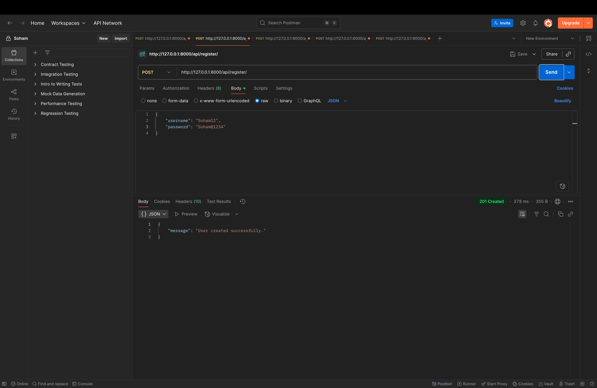
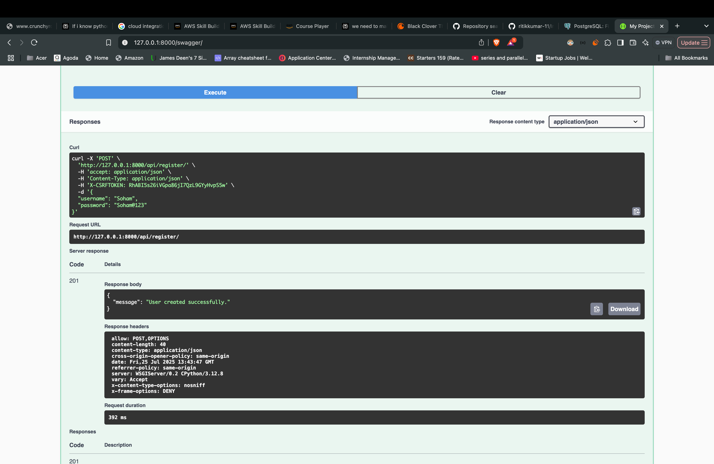
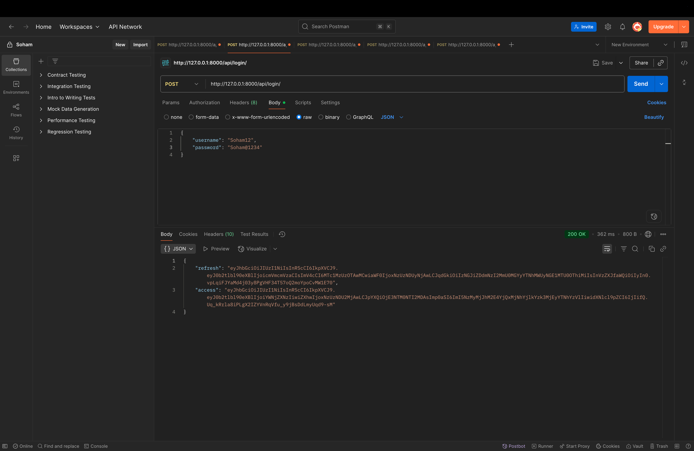
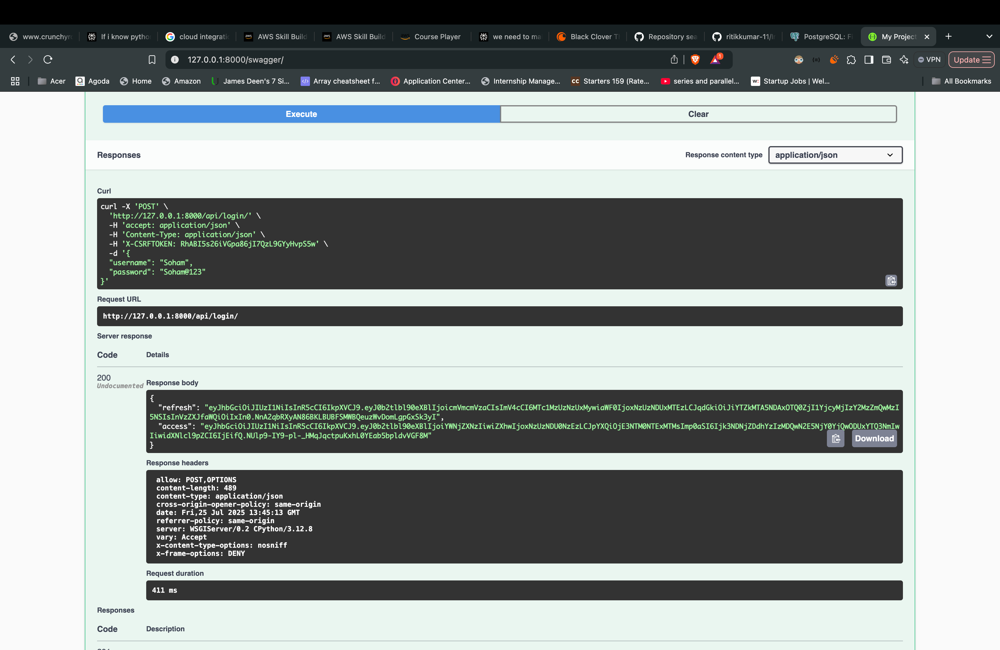
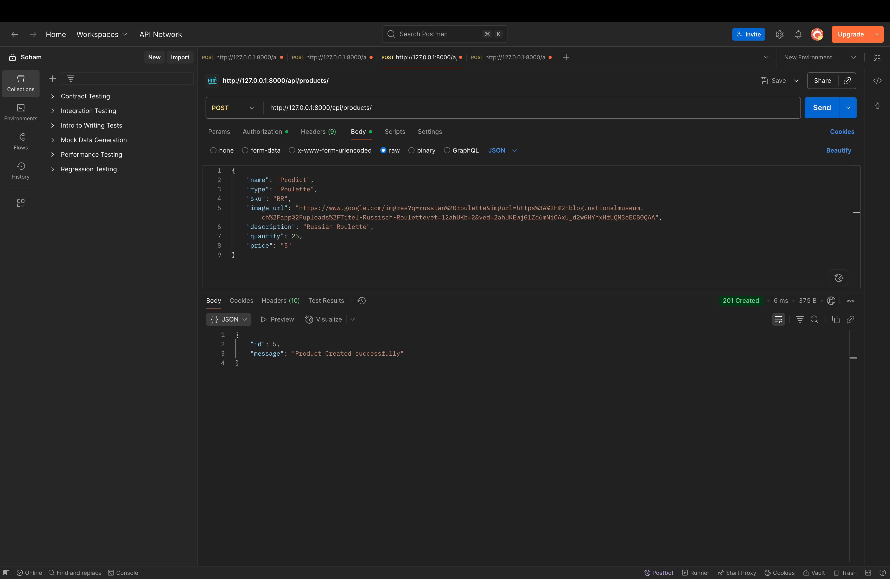
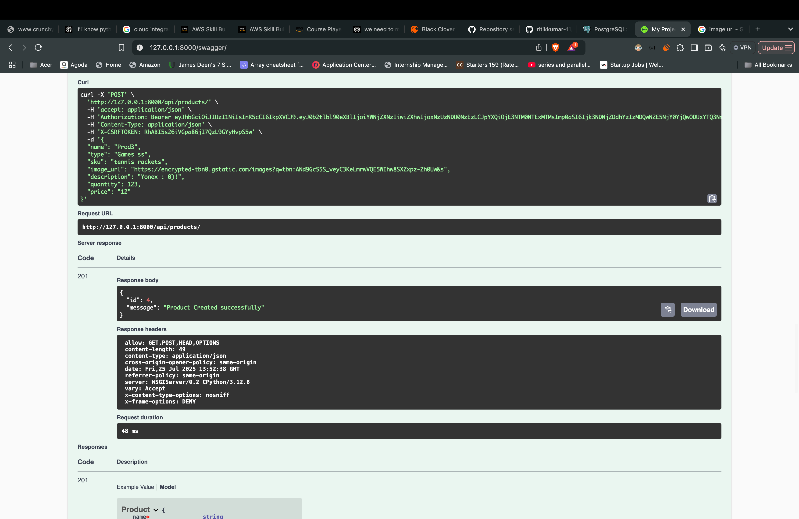
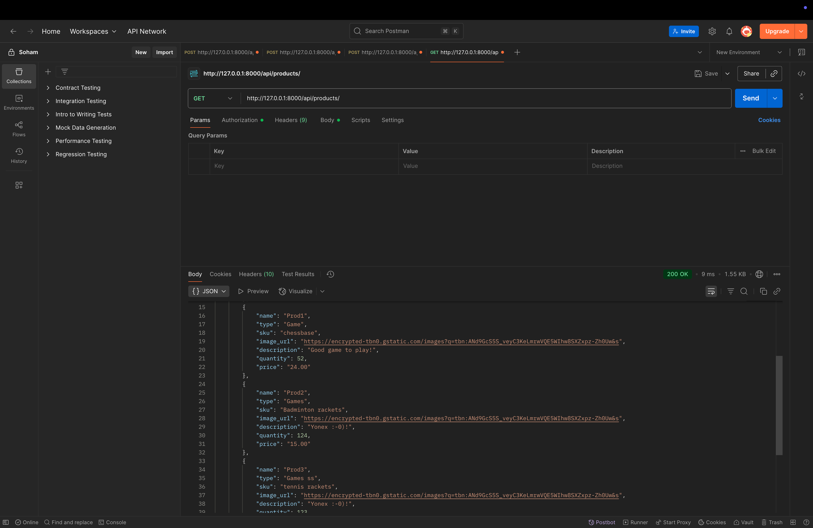
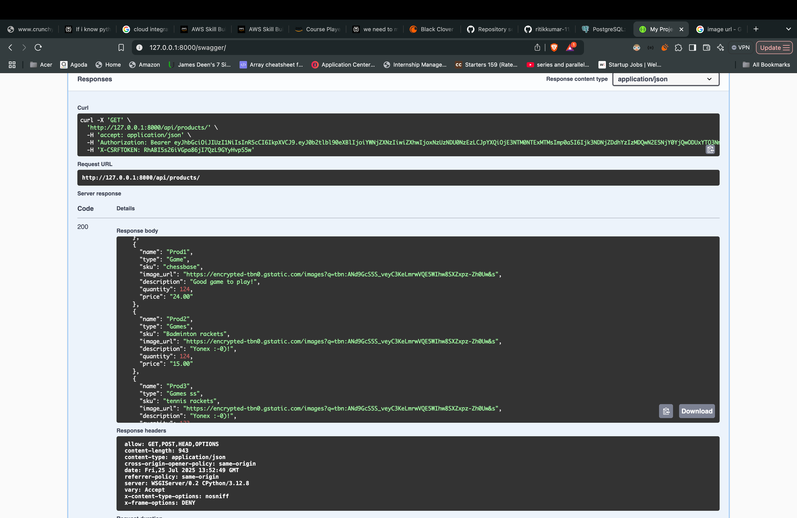

# 🧾 Inventory Management System (IMS) - Backend API

A lightweight backend application to manage inventory for a small business. This project provides RESTful APIs to handle user authentication and Basic operations on products and their inventory.

---

## Features

- 🔐 User Authentication (JWT-based login)
- ➕ Add new products
- 🔁 Update product quantities
- 📦 Get list of products with their details
- 📘 Swagger & Postman API documentation
- 🧪 Scripted API Testing
- 🛠️ Built with simplicity and clean code in mind

---

📁 Project Structure

        .
        ├── inventory_manage
        ├── Dockerfile
        ├── docker-compose.yml
        ├── inventory_management/
        │   ├── settings.py
        │   └── ...
        ├── manage.py
        └── requirements.txt

## 📦 Tech Stack

- **Backend**: Python (Django)
- **Database**: PostgreSQL
- **Auth**: JWT (JSON Web Tokens)
- **Docs**: Swagger/OpenAPI, Postman Collection

---

## 🔧 Setup Instructions

1. Clone the Repository**
   ```bash
   git clone https://github.com/your-username/inventory-management-backend.git
   cd inventory-management-backend
2. Set Up a Virtual Environment
    ```bash
    python -m venv venv
    source venv/bin/activate

3. Install Dependencies
    ```bash
    pip install -r requirements.txt

4. Setup Database as per YOU, and modify it acc. :
    ```bash
    settings.py
5. Run the Server
    ```bash
    python3 manage.py runserver

## 🐳 Dockerized Setup

This project is fully containerized using **Docker** and **Docker Compose**, allowing you to spin up the backend with a single command.

### 🔧 Requirements

- [Docker](https://www.docker.com/products/docker-desktop)
- [Docker Compose](https://docs.docker.com/compose/install/)

---

### 🚀 Quick Start

#### ⏳ 1. Build and start the application

    docker-compose up --build
#### ✅ 2. Run migrations (first time only)

    docker-compose exec web python manage.py migrate
#### 👤 3. Create an admin user

    docker-compose exec web python manage.py createsuperuser

    
📘 API Documentation
    You can explore and test all APIs through:

    Swagger UI:
    URL: http://localhost:8080/swagger/

    Redoc:
    URL: http://localhost:8080/redoc/

    Postman:
    Import the provided postman_collection.json file from the repo.

🧪 Testing the API
You can test the complete API workflow using the provided script:

Steps:
Edit the base URL:
1. Open test_api.py and set your local server:
    ```bash
      BASE_URL = "http://localhost:8080"

2. Run the script:
    ```bash
      python test_api.py

##Tests Included:

    User registration
    
    User login
    
    Add a product
    
    Update product quantity
    
    Fetch products list

Make sure your server is running before executing the test script.

🔐 Authentication
All product APIs require authentication using a Bearer Token.

1. Login:
      POST /login
      Returns a JWT token.

2.Use the Token in subsequent API calls:

      Authorization: Bearer <your_token_here>


## 📮 API Demonstrations

Below are examples showing both the **Postman request/response** and the corresponding **Docker terminal output** for each API.


---

### Register API (`POST /register`)

<table>
  <tr>
    <td><strong>Postman</strong></td>
    <td><strong>Swagger</strong></td>
  </tr>
  <tr>
    <td></td>
    <td></td>
  </tr>
</table>

---

### 🔐 Login API (`POST /login`)

<table>
  <tr>
    <td><strong>Postman</strong></td>
    <td><strong>Swagger</strong></td>
  </tr>
  <tr>
    <td></td>
    <td></td>
  </tr>
</table>

---

### ➕ Add Product API (`POST /products`)

<table>
  <tr>
    <td><strong>Postman</strong></td>
    <td><strong>Swagger</strong></td>
  </tr>
  <tr>
    <td></td>
    <td></td>
  </tr>
</table>

---

### 🔁 Update Product Quantity (`PUT /products/{id}/quantity`)

<table>
  <tr>
    <td><strong>Postman</strong></td>
    <td><strong>Swagger</strong></td>
  </tr>
  <tr>
    <td></td>
    <td></td>
  </tr>
</table>

---

### 📃 Get Products (`GET /products`)

<table>
  <tr>
    <td><strong>Postman</strong></td>
    <td><strong>Swagger</strong></td>
  </tr>
  <tr>
    <td></td>
    <td></td>
  </tr>
</table>
